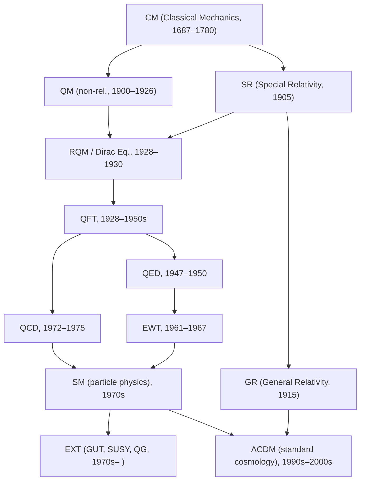

The diagram below traces the major theoretical developments from classical mechanics through to the current standard models of particle physics and cosmology, and the open frontiers beyond them.

| Abbreviation | Theory | Period |
|---|---|---|
| CM | Classical Mechanics (Newton–Lagrange era) | 1687– |
| QM | Quantum Mechanics (Planck, Schrödinger, Heisenberg) | 1900–1926 |
| SR | Special Relativity (Einstein) | 1905 |
| RQM | Relativistic Quantum Mechanics / Dirac equation | 1928–1930 |
| QFT | Quantum Field Theory (quantized fields, renormalization) | 1928–1950s |
| QED | Quantum Electrodynamics (renormalized formulation) | 1947–1950 |
| EWT | Electroweak Theory (Glashow, Weinberg, Salam) | 1961–1967 |
| QCD | Quantum Chromodynamics (asymptotic freedom) | 1972–1975 |
| SM | Standard Model (gauge structure consolidated) | 1970s |
| GR | General Relativity (Einstein field equations) | 1915 |
| ΛCDM | ΛCDM cosmology (concordance model) | 1990s–2000s |
| EXT | Extensions: GUTs, SUSY, quantum gravity, string theory | 1970s– |

Below is a compact description of each evolution step in the diagram, in logical order.

- **Classical Mechanics → Special Relativity (SR)**
    Newtonian mechanics fails at speeds close to light. **Special relativity** replaces absolute space and time with **Minkowski spacetime** and **Lorentz invariance**, preserving deterministic particle dynamics while transforming kinematics.

- **Classical Mechanics → Quantum Mechanics (QM, non-relativistic)**
    Blackbody radiation, the photoelectric effect, and atomic spectra cannot be explained classically. **Quantum mechanics** replaces deterministic trajectories with wavefunctions, and observables become non-commuting operators with inherently probabilistic outcomes.

- **QM → Relativistic Quantum Mechanics / Dirac Equation (RQM)**
    Incorporating special relativity into quantum mechanics for electrons yields the **Dirac equation**, which describes spin-$\frac{1}{2}$ particles, predicts **antimatter**, and signals the need for a framework that allows particle creation and annihilation.

- **SR → Relativistic Quantum Mechanics (RQM)**
    Demanding Lorentz-covariant wave equations for matter leads to the **Klein–Gordon** and **Dirac equations**, showing that relativistic invariance tightly constrains the allowed quantum dynamics.

- **RQM → Quantum Field Theory (QFT)**
    Difficulties with negative-energy states and variable particle number in relativistic quantum mechanics motivate **quantum field theory**, where fields are fundamental and particles are excitations of quantized fields. Creation and annihilation of particles arise naturally in this framework.

- **QFT → Quantum Electrodynamics (QED)**
    Applying QFT to the electromagnetic field and charged fermions yields **QED**, a $U(1)$ gauge theory. After **renormalization**, QED provides extremely precise predictions for processes involving light and electrons.

- **QFT → Quantum Chromodynamics (QCD)**
    Extending QFT to a non-Abelian $SU(3)$ gauge symmetry gives **QCD**, where quarks interact via gluons. QCD explains **asymptotic freedom** at high energies and **confinement** of color charge at low energies.

- **QED → Electroweak Theory (EWT)**
    Unifying electromagnetism with the weak interaction produces an $SU(2) \times U(1)$ gauge theory. The **Higgs mechanism** breaks the symmetry spontaneously, giving mass to the $W^\pm$ and $Z^0$ bosons while leaving the photon massless.

- **EWT + QCD → Standard Model (SM, particle physics)**
    Combining the electroweak $SU(2) \times U(1)$ sector with QCD's $SU(3)$ forms the **Standard Model** gauge group $SU(3) \times SU(2) \times U(1)$. This single renormalizable QFT organizes all known elementary fermions and gauge bosons.

- **Standard Model → Extensions (GUT, SUSY, Quantum Gravity, String Theory)**
    Open problems — neutrino masses, dark matter, the hierarchy problem, and the absence of gravity from the SM — motivate extensions. These include **grand unified theories** (GUTs), **supersymmetry** (SUSY), and attempts at a quantum theory of spacetime such as **string theory** and **loop quantum gravity**.

- **SR → General Relativity (GR)**
    Incorporating the **equivalence principle** and allowing spacetime to curve leads to **general relativity**, where gravity is encoded in the metric $g_{\mu\nu}$ and matter–energy determines curvature via the **Einstein field equations**.

- **GR → ΛCDM (Standard Model of Cosmology)**
    Applying GR to a homogeneous, expanding universe and adding **cold dark matter** and a **cosmological constant** $\Lambda$ yields the **ΛCDM model**. This concordance model fits cosmic microwave background, large-scale structure, and supernova data with a small set of parameters.

- **Standard Model (particle) → ΛCDM**
    The particle Standard Model supplies the microphysics for baryons, photons, and neutrinos, as well as early-universe processes such as **nucleosynthesis** and **recombination**. This matter–radiation content, together with GR and dark-sector components, underpins ΛCDM.

## Connections

- [[Classical Mechanics]]
- [[Special Relativity]]
- [[Quantum Mechanics]]
- [[Quantum Field Theory]]
- [[Standard Model]]
- [[General Relativity]]
- [[ΛCDM Model]]
- [[Beyond the Standard Model]]
- [[Quantum gravity]]
